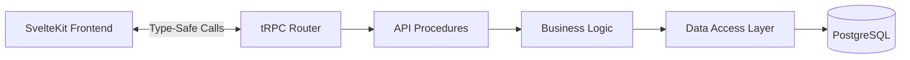
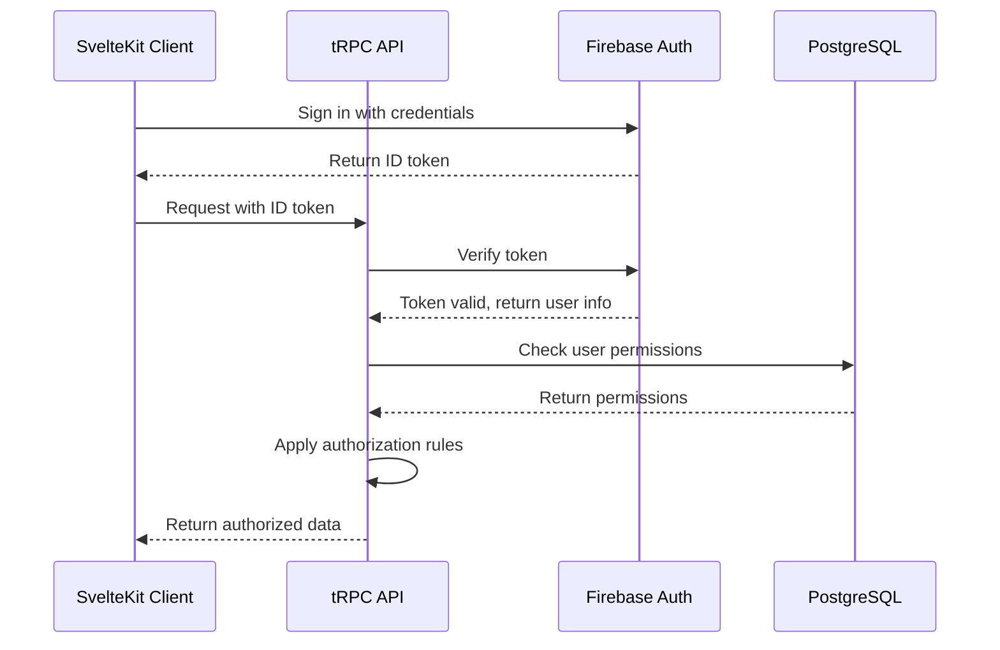
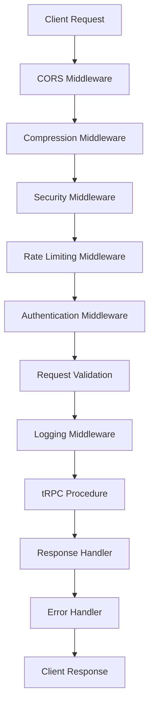
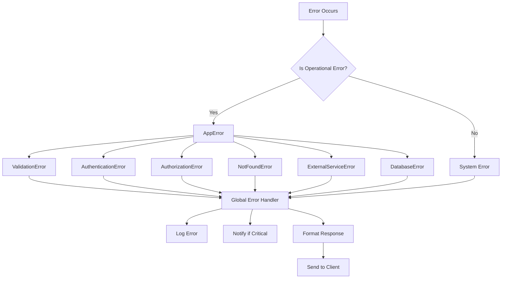
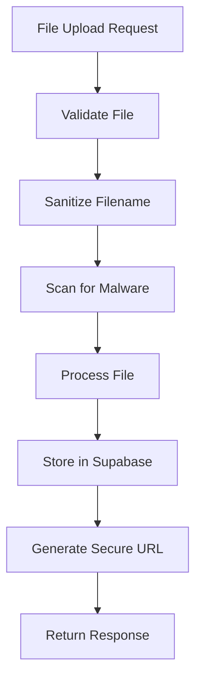
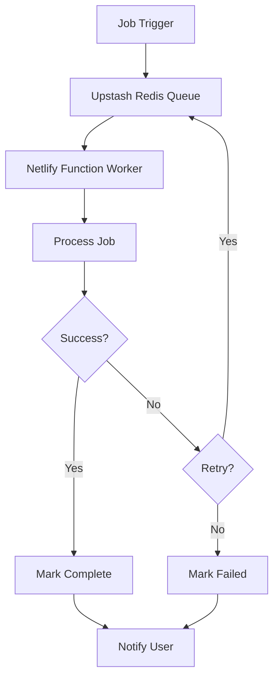
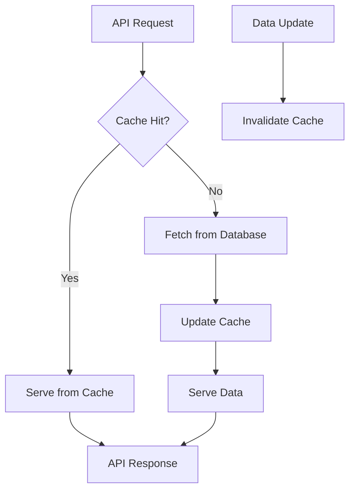
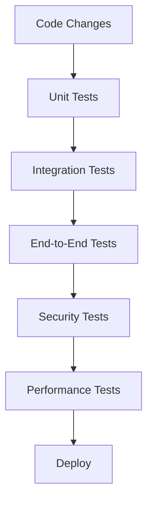
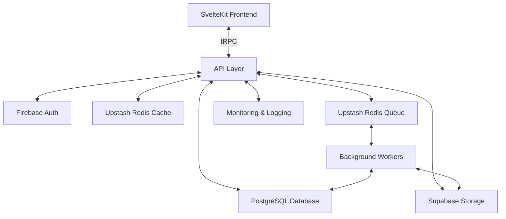

# Backend API Architecture for Expense Tracker Redesign

This document outlines the comprehensive backend API architecture for the redesigned expense tracker application. The architecture serves as the bridge between the SvelteKit frontend and PostgreSQL database, optimized for efficiency, low latency, scalability, security, maintainability, and developer experience.

## Table of Contents

1. [API Design Pattern: tRPC](#1-api-design-pattern-trpc)
2. [Authentication and Authorization with Firebase](#2-authentication-and-authorization-with-firebase)
3. [Middleware Architecture](#3-middleware-architecture)
4. [Error Handling and Logging Strategy](#4-error-handling-and-logging-strategy)
5. [Rate Limiting and Security Measures](#5-rate-limiting-and-security-measures)
6. [Data Validation Approach](#6-data-validation-approach)
7. [File Upload Handling](#7-file-upload-handling-for-receipts)
8. [Background Job Processing](#8-background-job-processing)
9. [Caching Strategy](#9-caching-strategy)
10. [API Documentation Approach](#10-api-documentation-approach)
11. [Testing Strategy](#11-testing-strategy)
12. [Monitoring and Observability](#12-monitoring-and-observability)
13. [Deployment Strategy on Netlify](#13-deployment-strategy-on-netlify)
14. [Complete Data Flow Diagram](#14-complete-data-flow-diagram)
15. [Detailed Endpoint Specifications](#15-detailed-endpoint-specifications)
16. [Implementation Plan](#16-implementation-plan)

## 1. API Design Pattern: tRPC

We'll implement tRPC as the API design pattern for the following benefits:



**Key Benefits:**
- **End-to-end Type Safety**: Eliminates runtime type errors between frontend and backend
- **Efficient Data Transfer**: Only sends the necessary data, reducing bandwidth usage
- **Developer Experience**: Auto-completion, type inference, and reduced boilerplate
- **Schema Validation**: Native integration with Zod for robust data validation
- **Simplified API Layer**: No need for separate API client code or OpenAPI specifications

**Implementation Details:**
- Create a tRPC router with procedures grouped by resource (users, trips, expenses, etc.)
- Implement input validation using Zod schemas
- Set up proper error handling and type definitions
- Configure tRPC client in the SvelteKit frontend

## 2. Authentication and Authorization with Firebase



**Implementation Details:**
- **JWT Validation**: Middleware to validate Firebase ID tokens
- **Role-Based Access Control**: Implement roles (admin, regular user) with Firebase custom claims
- **Permission Middleware**: Create middleware for checking permissions at the procedure level
- **Row-Level Security**: Implement in PostgreSQL to ensure users can only access their own data
- **Session Management**: Secure handling of authentication state with proper token refresh

## 3. Middleware Architecture



**Implementation Details:**
- **CORS**: Configure proper Cross-Origin Resource Sharing for security
- **Compression**: Compress responses for faster data transfer
- **Security**: Implement Helmet for security headers
- **Rate Limiting**: Protect against abuse with IP and user-based limits
- **Authentication**: Verify Firebase tokens and attach user data
- **Validation**: Validate request data using Zod schemas
- **Logging**: Log requests and responses with sensitive data redaction
- **Error Handling**: Centralized error handling with proper client responses

## 4. Error Handling and Logging Strategy

### Error Handling



**Implementation Details:**
- **Custom Error Classes**: Extend the existing error classes for more specific error types
- **Error Context**: Add request ID and additional context to errors
- **Centralized Handling**: Global error handler middleware for consistent responses
- **Environment-Specific Responses**: Detailed errors in development, sanitized in production
- **Error Monitoring**: Integration with Sentry or similar service for real-time error tracking

### Logging Strategy

**Implementation Details:**
- **Structured Logging**: JSON format for machine-readable logs
- **Log Levels**: debug, info, warn, error, with appropriate filtering
- **Request Context**: Include request ID, user ID, and other context
- **Sensitive Data Redaction**: Automatically redact passwords, tokens, etc.
- **Performance Metrics**: Log response times and resource usage
- **External Integration**: Send logs to a monitoring service for analysis

## 5. Rate Limiting and Security Measures

### Rate Limiting

**Implementation Details:**
- **Tiered Rate Limits**:
  - Authentication endpoints: 10 requests per minute per IP
  - Standard API endpoints: 60 requests per minute per user
  - File upload endpoints: 10 requests per minute per user
- **Response Headers**: Include rate limit information in headers
- **Graceful Degradation**: Return 429 status with retry-after header
- **Storage**: Use Redis to track rate limits across serverless functions

### Security Measures

**Implementation Details:**
- **Content Security Policy (CSP)**: Restrict resource loading to trusted sources
- **CSRF Protection**: Implement token-based CSRF protection for state-changing operations
- **XSS Prevention**: Proper output encoding and input sanitization
- **SQL Injection Prevention**: Use Drizzle ORM with parameterized queries
- **Secure Headers**: Implement with Helmet middleware
- **HTTPS Enforcement**: Redirect all HTTP traffic to HTTPS
- **Dependency Scanning**: Regular audits of dependencies for vulnerabilities
- **API Key Rotation**: Regular rotation of API keys and secrets

## 6. Data Validation Approach

**Implementation Details:**
- **Schema Validation**: Use Zod for defining validation schemas
- **Validation Middleware**: Apply validation to request bodies, query parameters, and URL parameters
- **Custom Validators**: Implement application-specific validation rules
- **Consistent Error Responses**: Standardized format for validation errors
- **Sanitization**: Sanitize inputs to prevent XSS and injection attacks

Example Zod schema for expense creation:

```typescript
const createExpenseSchema = z.object({
  tripId: z.string().uuid().optional(),
  type: z.string(),
  date: z.string().datetime(),
  vendor: z.string().min(1).max(100),
  location: z.string().optional(),
  cost: z.number().positive(),
  currency: z.string().length(3).default("USD"),
  comments: z.string().optional(),
});
```

## 7. File Upload Handling (for Receipts)



**Implementation Details:**
- **Validation**: Validate file type (image/pdf), size (max 10MB), and content
- **Secure Storage**: Continue using Supabase Storage with enhanced security
- **Virus Scanning**: Implement malware scanning for uploaded files
- **Secure File Names**: Generate random, non-guessable file names
- **Access Control**: Implement proper access control for file retrieval
- **Cleanup**: Automatically delete orphaned files
- **Resumable Uploads**: Support for large file uploads with resumable functionality

## 8. Background Job Processing



**Implementation Details:**
- **Job Queue**: Implement Upstash Redis for serverless-compatible job queue
- **Worker Functions**: Separate Netlify functions for processing jobs
- **Job Status Tracking**: Store job status in the database
- **Retry Mechanism**: Implement exponential backoff for failed jobs
- **Notification System**: Notify users when jobs complete or fail
- **Monitoring**: Track job performance and failure rates
- **Job Types**: OCR processing, batch imports/exports, email notifications

## 9. Caching Strategy



**Implementation Details:**
- **Cache Layer**: Implement Upstash Redis for caching
- **Cache Strategies**:
  - **User Data**: Short TTL (5 minutes) with invalidation on update
  - **Trip Data**: Medium TTL (15 minutes) with invalidation on update
  - **Expense Summaries**: Medium TTL (15 minutes) with invalidation on update
  - **Static Data**: Long TTL (1 hour) with manual invalidation
- **Cache Keys**: Structured keys including user ID for proper isolation
- **HTTP Caching**: Implement proper cache-control headers
- **Stale-While-Revalidate**: Serve stale data while fetching fresh data in background

## 10. API Documentation Approach

**Implementation Details:**
- **OpenAPI/Swagger**: Generate API documentation from code
- **Interactive Documentation**: Provide a Swagger UI for testing endpoints
- **Code Examples**: Include examples for common operations
- **Error Documentation**: Document all possible error responses
- **Authentication Documentation**: Clear instructions for authentication
- **Versioning**: Document API versioning strategy
- **Markdown Documentation**: Generate markdown documentation for GitHub

## 11. Testing Strategy



**Implementation Details:**
- **Unit Testing**: Test individual functions and components with Vitest
- **Integration Testing**: Test API endpoints with database interactions
- **End-to-End Testing**: Test complete user flows with Playwright
- **Security Testing**: Test for common vulnerabilities
- **Performance Testing**: Test API performance under load
- **CI/CD Integration**: Automate testing in the CI/CD pipeline
- **Test Coverage**: Aim for high test coverage of critical paths
- **Mocking**: Proper mocking of external services for reliable tests

## 12. Monitoring and Observability

**Implementation Details:**
- **Application Performance Monitoring (APM)**: Implement with a service like Datadog or New Relic
- **Error Tracking**: Implement with Sentry for real-time error monitoring
- **Distributed Tracing**: Track requests across services
- **Health Checks**: Implement health check endpoints
- **Metrics Collection**: Track key performance indicators
- **Alerting**: Set up alerts for critical issues
- **Logging**: Centralized logging with search capabilities
- **Dashboard**: Create a monitoring dashboard for key metrics

## 13. Deployment Strategy on Netlify

**Implementation Details:**
- **Serverless Functions**: Continue using Netlify Functions for API endpoints
- **Environment Configuration**: Proper management of environment variables
- **CI/CD Pipeline**: Automated testing and deployment
- **Staging Environment**: Implement a staging environment for testing
- **Rollback Strategy**: Quick rollback in case of issues
- **Monitoring Integration**: Integrate monitoring tools with Netlify
- **Edge Functions**: Consider Netlify Edge Functions for performance-critical operations
- **Function Bundling**: Optimize function size and cold start times

## 14. Complete Data Flow Diagram



## 15. Detailed Endpoint Specifications

### User Management
- `users.profile.get`: Get user profile
- `users.profile.update`: Update user profile
- `users.settings.get`: Get user settings
- `users.settings.update`: Update user settings

### Trip Management
- `trips.list`: Get all trips for the current user
- `trips.get`: Get a specific trip
- `trips.create`: Create a new trip
- `trips.update`: Update a trip
- `trips.delete`: Delete a trip
- `trips.expenses.list`: Get expenses for a trip
- `trips.mileage.list`: Get mileage logs for a trip

### Expense Management
- `expenses.list`: Get all expenses for the current user
- `expenses.get`: Get a specific expense
- `expenses.create`: Create a new expense
- `expenses.update`: Update an expense
- `expenses.delete`: Delete an expense
- `expenses.batch.upload`: Batch upload expenses

### Receipt Management
- `receipts.upload`: Upload a receipt
- `receipts.get`: Get a receipt
- `receipts.ocr.process`: Process a receipt with OCR
- `receipts.ocr.result`: Get OCR results for a receipt

### Mileage Management
- `mileage.list`: Get all mileage logs for the current user
- `mileage.get`: Get a specific mileage log
- `mileage.create`: Create a new mileage log
- `mileage.update`: Update a mileage log
- `mileage.delete`: Delete a mileage log
- `mileage.odometer.process`: Process an odometer image

### Export Management
- `export.expenses`: Export expenses to various formats
- `export.trips`: Export trips to various formats
- `export.mileage`: Export mileage logs to various formats
- `export.status`: Get the status of an export job
- `export.download`: Download an exported file

### Background Task Management
- `tasks.list`: Get all background tasks for the current user
- `tasks.get`: Get a specific background task
- `tasks.delete`: Delete a background task

## 16. Implementation Plan

1. **Setup Phase (1-2 weeks)**
   - Set up tRPC server and client
   - Configure Firebase authentication
   - Set up Upstash Redis for caching and job queue
   - Configure Supabase Storage for file uploads

2. **Core API Development (2-3 weeks)**
   - Implement user management endpoints
   - Implement trip management endpoints
   - Implement expense management endpoints
   - Implement mileage management endpoints

3. **Advanced Features (2-3 weeks)**
   - Implement file upload handling
   - Implement OCR processing
   - Implement background job processing
   - Implement export functionality

4. **Testing and Optimization (1-2 weeks)**
   - Write unit and integration tests
   - Optimize performance
   - Implement caching
   - Security audit

5. **Documentation and Deployment (1 week)**
   - Generate API documentation
   - Set up monitoring and logging
   - Configure CI/CD pipeline
   - Deploy to production