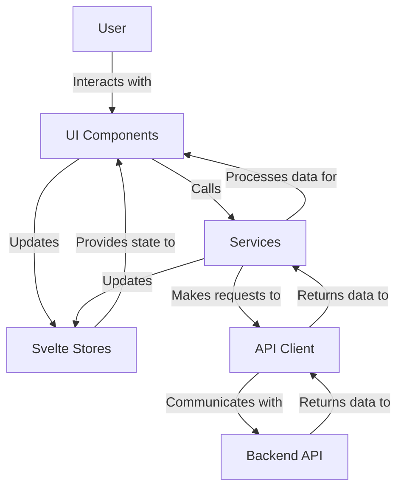
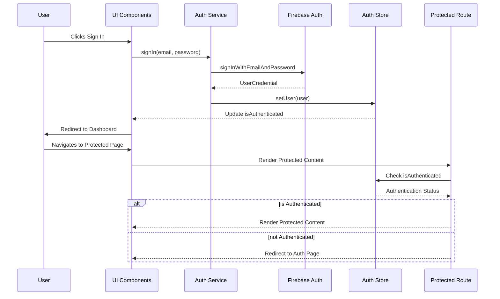

# Component Diagram

```mermaid
graph TD
    subgraph "Application"
        App[App.svelte]
        Layout[AppLayout.svelte]
        
        subgraph "Layout Components"
            Header[Header.svelte]
            Sidebar[Sidebar.svelte]
            Footer[Footer.svelte]
        end
        
        subgraph "Page Components"
            Home[Home Page]
            Dashboard[Dashboard Page]
            Expenses[Expenses Page]
            Trips[Trips Page]
            Mileage[Mileage Page]
            Auth[Auth Page]
            Settings[Settings Page]
            Error[Error Page]
        end
        
        subgraph "Feature Components"
            ExpenseForm[Expense Form]
            ExpenseList[Expense List]
            ExpenseDetail[Expense Detail]
            TripForm[Trip Form]
            TripList[Trip List]
            TripDetail[Trip Detail]
            MileageForm[Mileage Form]
            MileageList[Mileage List]
        end
        
        subgraph "UI Components"
            Button[Button]
            Input[Input]
            Select[Select]
            Modal[Modal]
            Table[Table]
            Card[Card]
            Alert[Alert]
            Dropdown[Dropdown]
        end
        
        subgraph "Services"
            AuthService[Auth Service]
            ApiClient[API Client]
        end
        
        subgraph "Stores"
            AuthStore[Auth Store]
            ExpenseStore[Expense Store]
            TripStore[Trip Store]
            MileageStore[Mileage Store]
        end
    end
    
    App --> Layout
    Layout --> Header
    Layout --> Sidebar
    Layout --> Footer
    Layout --> Page Components
    
    Home --> Button
    Dashboard --> Card
    Dashboard --> Table
    Expenses --> ExpenseList
    Expenses --> ExpenseForm
    Trips --> TripList
    Trips --> TripForm
    Mileage --> MileageList
    Mileage --> MileageForm
    
    ExpenseList --> Table
    ExpenseForm --> Input
    ExpenseForm --> Select
    ExpenseForm --> Button
    TripList --> Table
    TripForm --> Input
    TripForm --> Button
    MileageList --> Table
    MileageForm --> Input
    MileageForm --> Button
    
    Auth --> AuthService
    ExpenseList --> ApiClient
    ExpenseForm --> ApiClient
    TripList --> ApiClient
    TripForm --> ApiClient
    MileageList --> ApiClient
    MileageForm --> ApiClient
    
    AuthService --> AuthStore
    ExpenseList --> ExpenseStore
    ExpenseForm --> ExpenseStore
    TripList --> TripStore
    TripForm --> TripStore
    MileageList --> MileageStore
    MileageForm --> MileageStore
```

# Data Flow Diagram



# Authentication Flow



# Component Hierarchy

```mermaid
graph TD
    App[App.svelte] --> Layout[AppLayout.svelte]
    Layout --> Header[Header.svelte]
    Layout --> Sidebar[Sidebar.svelte]
    Layout --> Content[Content Area]
    Layout --> Footer[Footer.svelte]
    
    Content --> Home[Home Page]
    Content --> Dashboard[Dashboard Page]
    Content --> Expenses[Expenses Page]
    Content --> Trips[Trips Page]
    Content --> Mileage[Mileage Page]
    Content --> Settings[Settings Page]
    
    Expenses --> ExpenseList[ExpenseList.svelte]
    Expenses --> ExpenseForm[ExpenseForm.svelte]
    Expenses --> ExpenseDetail[ExpenseDetail.svelte]
    
    Trips --> TripList[TripList.svelte]
    Trips --> TripForm[TripForm.svelte]
    Trips --> TripDetail[TripDetail.svelte]
    
    Mileage --> MileageList[MileageList.svelte]
    Mileage --> MileageForm[MileageForm.svelte]
    Mileage --> MileageDetail[MileageDetail.svelte]