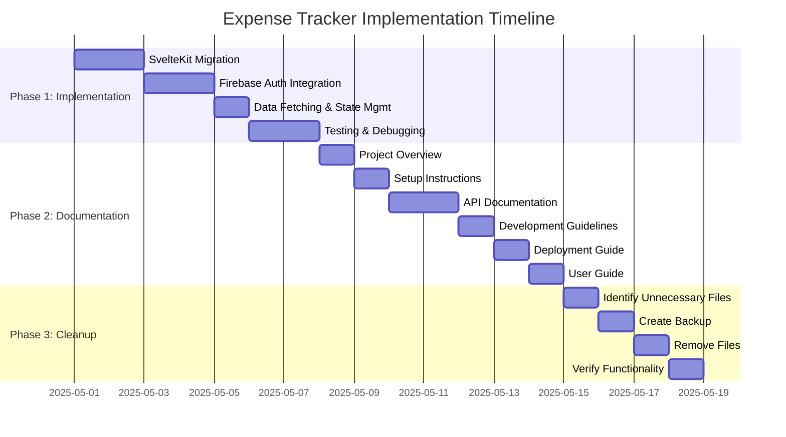
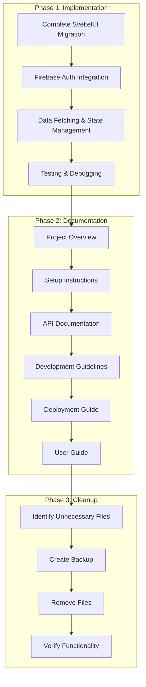

# Expense Tracker Documentation Plan

## Overview

This document outlines the comprehensive plan for completing the expense tracker application, creating documentation, and cleaning up the codebase. The plan is divided into three main phases:

1. Implementation Phase: Complete the SvelteKit migration
2. Documentation Phase: Create comprehensive documentation
3. Cleanup Phase: Remove unnecessary files from the codebase

## Phase 1: Implementation

### 1.1. Complete SvelteKit Migration
- Convert remaining React components to Svelte components
- Implement the dashboard with proper data visualization
- Complete the Period Comparison component (marked as "Coming soon...")
- Ensure all charts and data visualizations are working

### 1.2. Firebase Authentication Integration
- Complete the migration from Clerk to Firebase Authentication
- Ensure all authentication flows (sign-up, sign-in, password reset) are working
- Update any remaining Clerk references in the codebase

### 1.3. Data Fetching and State Management
- Implement Svelte stores for state management
- Ensure proper data fetching from the API
- Implement error handling and loading states

### 1.4. Testing and Debugging
- Test all features to ensure they're working correctly
- Fix any bugs or issues found during testing
- Ensure the application works on different devices and browsers

## Phase 2: Documentation

### 2.1. Project Overview Documentation
- Create introduction with features and benefits
- Document the SvelteKit/Firebase/Supabase architecture
- Document the technology stack with versions and purposes
- Document the project structure with directory explanations

### 2.2. Setup Instructions (Priority)
- Document development environment setup
- Document database setup with Supabase
- Document Firebase authentication configuration
- Document environment variables
- Document local development workflow
- Document testing setup

### 2.3. API Documentation (Priority)
- Document tRPC endpoints with request/response examples
- Document authentication flows
- Document database schema with relationships
- Document file upload handling
- Document error handling

### 2.4. Development Guidelines
- Document code style guidelines for SvelteKit
- Document component structure and organization
- Document state management with Svelte stores
- Document testing practices
- Document Git workflow and branching strategy
- Document release process

### 2.5. Deployment Guide
- Document Netlify deployment process
- Document environment configuration for production
- Document database migration process
- Document monitoring setup
- Document troubleshooting steps

### 2.6. User Guide
- Document features from a user perspective
- Document common workflows
- Document best practices
- Create FAQ section
- Document troubleshooting steps for users

## Phase 3: Cleanup

### 3.1. Identify Unnecessary Files
- Identify MD files in the root directory (except README.md) that can be removed
- Identify JavaScript files used for one-time operations or debugging
- Identify files from the previous implementation (previous frontend and backend)

### 3.2. Create Backup
- Create a backup of the codebase before removing files
- Document the files being removed for reference

### 3.3. Remove Unnecessary Files
- Remove identified MD files
- Remove identified JavaScript files
- Remove files from the previous implementation

### 3.4. Verify Application Functionality
- Ensure the application still builds and runs correctly after cleanup
- Test all features to ensure nothing was broken during cleanup
- Fix any issues that arise

## Implementation Timeline

## Workflow Diagram

## Conclusion

This plan provides a comprehensive roadmap for completing the expense tracker application, creating thorough documentation, and cleaning up the codebase. The implementation is prioritized to ensure that the documentation reflects the final state of the application. Within the documentation phase, API documentation and setup instructions are given priority as requested.

By following this plan, we will create a well-documented, clean, and fully functional expense tracker application that will be easy to maintain and extend in the future.