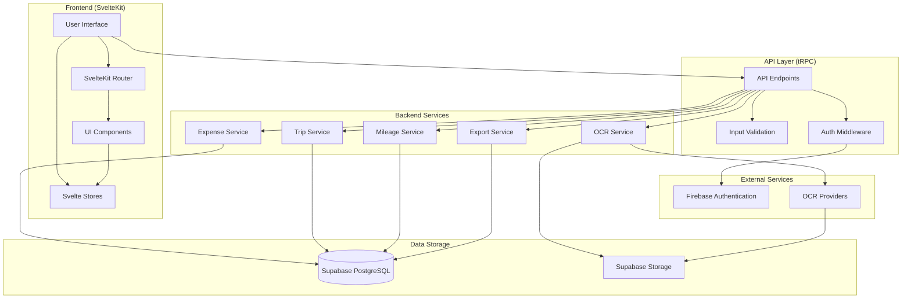

# Project Overview

## Introduction

The Expense Tracker is a comprehensive web application designed to help users track, manage, and analyze their expenses efficiently. It provides a user-friendly interface for recording expenses, categorizing them, attaching receipts, and generating insightful reports and visualizations.

## Key Features

- **Expense Tracking**: Record and categorize expenses with detailed information
- **Receipt Management**: Attach and store digital copies of receipts
- **OCR Functionality**: Extract expense information from receipts automatically
- **Data Visualization**: View spending patterns through interactive charts and graphs
- **Trip Management**: Organize expenses by trips for better tracking
- **Mileage Logging**: Track travel distances and associated expenses
- **Export Functionality**: Export expense data in various formats (CSV, Excel)
- **User Authentication**: Secure user authentication and authorization
- **Responsive Design**: Optimized for both desktop and mobile devices
- **Offline Support**: Basic functionality available offline with data synchronization

## Technology Stack

### Frontend
- **Framework**: SvelteKit - A modern framework for building web applications
- **UI/Styling**: TailwindCSS - A utility-first CSS framework
- **Data Visualization**: Chart.js - JavaScript charting library
- **State Management**: Svelte stores - Built-in reactive state management

### Backend
- **API Layer**: tRPC - End-to-end typesafe API framework
- **Database**: Supabase (PostgreSQL) - Open source Firebase alternative
- **Authentication**: Firebase Authentication - Secure user authentication
- **File Storage**: Supabase Storage - Object storage for files and receipts
- **OCR Processing**: Multi-provider OCR system (Google Vision, Azure Cognitive Services, Tesseract)

### Infrastructure
- **Hosting**: Netlify - Platform for deploying and hosting web applications
- **Serverless Functions**: Netlify Functions - Serverless compute for API endpoints
- **Database Hosting**: Supabase Cloud - Managed PostgreSQL database
- **CI/CD**: GitHub Actions - Automated testing and deployment

## Architecture Diagram



## System Requirements

### Development Environment
- **Node.js**: v16.x or higher
- **npm**: v7.x or higher
- **Git**: For version control
- **Modern web browser**: Chrome, Firefox, Safari, or Edge

### Production Environment
- **Netlify Account**: For hosting the application
- **Supabase Account**: For database and storage
- **Firebase Account**: For authentication services
- **OCR Provider Accounts**: For receipt processing (optional)

## Project Structure

The project follows a modular structure organized by feature and responsibility:

```
expense-tracker/
├── client/                  # Frontend client code
│   ├── src/                 # Source files
│   │   ├── components/      # Reusable UI components
│   │   ├── lib/             # Utility functions and shared code
│   │   ├── routes/          # SvelteKit routes and pages
│   │   ├── stores/          # Svelte stores for state management
│   │   └── app.css          # Global styles
├── server/                  # Backend server code
│   ├── routes/              # API route definitions
│   ├── storage/             # Database access layer
│   ├── util/                # Utility functions
│   │   └── ocr/             # OCR processing modules
│   └── index.ts             # Server entry point
├── shared/                  # Shared code between client and server
│   └── schema.ts            # Database schema definitions
├── netlify/                 # Netlify configuration
│   └── functions/           # Serverless functions
├── migrations/              # Database migration files
├── docs/                    # Documentation
└── tests/                   # Test files
    ├── e2e/                 # End-to-end tests
    └── unit/                # Unit tests
```

## Data Flow

1. **User Interaction**: Users interact with the UI components in the frontend
2. **State Management**: Svelte stores manage the application state
3. **API Requests**: tRPC client sends requests to the API endpoints
4. **Authentication**: Requests are authenticated via Firebase Authentication
5. **Data Processing**: Backend services process the requests
6. **Database Operations**: Services interact with the Supabase database
7. **Response**: Data is returned to the frontend and displayed to the user

This architecture provides a clean separation of concerns, type safety across the stack, and a smooth developer experience.