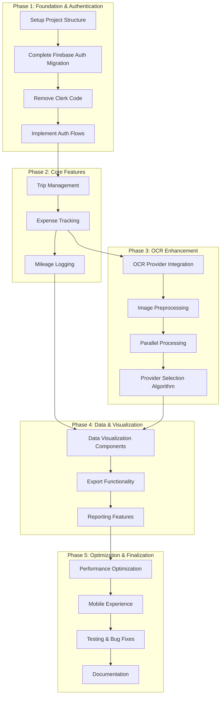
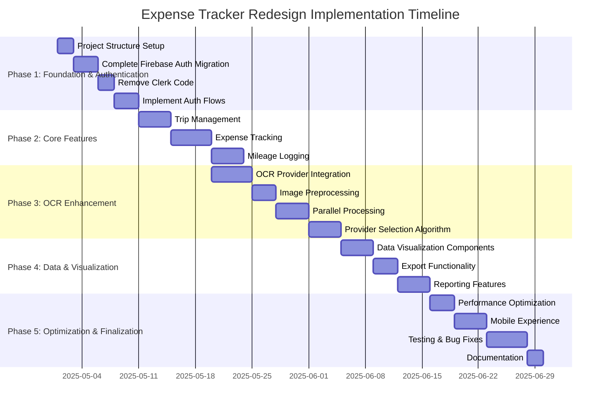

# Expense Tracker Redesign: Detailed Project Plan

## Project Overview

The expense tracker redesign will:
- Use SvelteKit as the frontend framework
- Complete the migration from Clerk to Firebase Authentication
- Improve OCR processing for receipts using AI providers
- Enhance the user experience across all functional areas
- Implement a type-safe API architecture with tRPC

## Task Breakdown and Implementation Plan

### Task Breakdown Table

| Task ID | Task Name | Description | Priority | Effort (Days) | Dependencies | Functional Area | Phase |
|---------|-----------|-------------|----------|---------------|--------------|-----------------|-------|
| **A1** | Project Structure Setup | Initialize SvelteKit project with tRPC, configure build process | High | 2 | None | Infrastructure | 1 |
| **A2** | Complete Firebase Auth Migration | Finalize Firebase Authentication implementation | High | 3 | A1 | Authentication | 1 |
| **A3** | Remove Clerk Code | Remove all Clerk-related code and dependencies | High | 2 | A2 | Authentication | 1 |
| **A4** | Implement Auth Flows | Implement sign-up, sign-in, password reset flows | High | 3 | A3 | Authentication | 1 |
| **B1** | Trip Management | Implement CRUD operations for trips | High | 4 | A4 | Trip Management | 2 |
| **B2** | Expense Tracking | Implement expense tracking with receipt uploads | High | 5 | B1 | Expense Tracking | 2 |
| **B3** | Mileage Logging | Implement mileage logging functionality | Medium | 4 | B2 | Mileage Logging | 2 |
| **C1** | OCR Provider Integration | Integrate multiple AI providers for OCR | High | 5 | B2 | OCR Processing | 3 |
| **C2** | Image Preprocessing | Implement image preprocessing for better OCR results | Medium | 3 | C1 | OCR Processing | 3 |
| **C3** | Parallel Processing | Implement parallel processing for OCR | Medium | 4 | C2 | OCR Processing | 3 |
| **C4** | Provider Selection Algorithm | Develop algorithm to select optimal OCR provider | Medium | 4 | C3 | OCR Processing | 3 |
| **D1** | Data Visualization Components | Create charts and visualizations for expenses and trips | Medium | 4 | B3, C4 | Data Visualization | 4 |
| **D2** | Export Functionality | Implement data export to various formats | Medium | 3 | D1 | Export | 4 |
| **D3** | Reporting Features | Create comprehensive reporting features | Low | 4 | D2 | Reporting | 4 |
| **E1** | Performance Optimization | Optimize application performance | Medium | 3 | D3 | Optimization | 5 |
| **E2** | Mobile Experience | Enhance mobile user experience | Medium | 4 | E1 | UI/UX | 5 |
| **E3** | Testing & Bug Fixes | Comprehensive testing and bug fixing | High | 5 | E2 | Quality Assurance | 5 |
| **E4** | Documentation | Create user and developer documentation | Low | 2 | E3 | Documentation | 5 |

## Detailed Task Descriptions

### Phase 1: Foundation & Authentication (10 days)

#### A1: Project Structure Setup (2 days)
- Initialize SvelteKit project with proper configuration
- Set up tRPC for type-safe API
- Configure build process for Netlify deployment
- Set up linting and formatting rules

#### A2: Complete Firebase Auth Migration (3 days)
- Verify Firebase Authentication configuration
- Ensure all authentication endpoints use Firebase
- Implement JWT validation and refresh logic
- Add comprehensive error handling for authentication failures

#### A3: Remove Clerk Code (2 days)
- Remove Clerk webhook handler
- Clean up all Clerk-specific authentication code
- Update all authentication references to use Firebase
- Remove Clerk dependencies from the project

#### A4: Implement Auth Flows (3 days)
- Implement sign-up flow with email verification
- Implement sign-in flow with proper error handling
- Implement password reset functionality
- Create protected route mechanism

### Phase 2: Core Features (13 days)

#### B1: Trip Management (4 days)
- Implement CRUD operations for trips
- Create trip listing with filtering and sorting
- Implement trip details view
- Add trip summary statistics

#### B2: Expense Tracking (5 days)
- Implement CRUD operations for expenses
- Create expense categorization
- Implement receipt upload functionality
- Associate expenses with trips
- Create expense listing with filtering and sorting

#### B3: Mileage Logging (4 days)
- Implement CRUD operations for mileage logs
- Create odometer reading input (manual and OCR)
- Calculate distance and estimated costs
- Associate mileage logs with trips
- Create mileage log listing with filtering and sorting

### Phase 3: OCR Enhancement (16 days)

#### C1: OCR Provider Integration (5 days)
- Integrate multiple AI providers (Gemini, OpenAI, Claude)
- Create unified interface for OCR providers
- Implement provider-specific prompting strategies
- Add error handling and fallback mechanisms

#### C2: Image Preprocessing (3 days)
- Implement image optimization before OCR processing
- Add contrast enhancement and noise reduction
- Implement automatic cropping to focus on receipt content
- Add receipt orientation detection and correction

#### C3: Parallel Processing (4 days)
- Create a worker pool for processing multiple receipts
- Implement a queue system for batch processing
- Add concurrency limits to prevent rate limiting
- Implement asynchronous file handling

#### C4: Provider Selection Algorithm (4 days)
- Collect performance metrics for each provider
- Create a database schema for storing provider performance
- Implement algorithm to select optimal provider based on:
  - Historical accuracy for similar receipt types
  - Current response times
  - Cost considerations
- Add automatic failover between providers

### Phase 4: Data & Visualization (11 days)

#### D1: Data Visualization Components (4 days)
- Create expense breakdown by category chart
- Implement expense trends over time chart
- Create trip-specific visualizations
- Implement dashboard with summary statistics

#### D2: Export Functionality (3 days)
- Implement export to CSV, Excel, and PDF
- Add customizable export options (date range, categories)
- Create export job scheduling
- Implement export status tracking

#### D3: Reporting Features (4 days)
- Create comprehensive reporting interface
- Implement report generation for different time periods
- Add custom report templates
- Create scheduled report generation

### Phase 5: Optimization & Finalization (14 days)

#### E1: Performance Optimization (3 days)
- Optimize database queries
- Implement caching strategies
- Reduce bundle size
- Optimize image loading and processing

#### E2: Mobile Experience (4 days)
- Enhance responsive design
- Optimize for touch interactions
- Implement direct camera access for receipt uploads
- Add offline capabilities

#### E3: Testing & Bug Fixes (5 days)
- Implement unit tests for critical components
- Add integration tests for key workflows
- Perform end-to-end testing
- Fix identified bugs and issues

#### E4: Documentation (2 days)
- Create user documentation
- Write developer documentation
- Document API endpoints
- Create deployment guide

## Implementation Timeline

## Key Milestones

1. **Authentication Complete** - End of Phase 1 (Day 10)
   - Firebase Authentication fully implemented
   - All Clerk code removed
   - Authentication flows working properly

2. **Core Features Complete** - End of Phase 2 (Day 23)
   - Trip management implemented
   - Expense tracking with basic receipt upload working
   - Mileage logging functional

3. **OCR Enhancement Complete** - End of Phase 3 (Day 39)
   - Multiple AI providers integrated
   - Image preprocessing implemented
   - Parallel processing working
   - Provider selection algorithm functional

4. **Data & Visualization Complete** - End of Phase 4 (Day 50)
   - Data visualization components implemented
   - Export functionality working
   - Reporting features available

5. **Project Complete** - End of Phase 5 (Day 64)
   - Performance optimized
   - Mobile experience enhanced
   - Testing completed and bugs fixed
   - Documentation created

## Critical Path

The critical path for this project runs through:
1. Authentication setup (A1 → A2 → A3 → A4)
2. Core expense tracking functionality (B1 → B2)
3. OCR enhancement (C1 → C2 → C3 → C4)
4. Data visualization and reporting (D1 → D2 → D3)
5. Final optimization and testing (E1 → E2 → E3 → E4)

Any delays in these tasks will directly impact the project timeline.

## Implementation Considerations

1. **Authentication**: Prioritize completing the Firebase Authentication migration to establish a solid foundation.

2. **OCR Processing**: Focus on both speed and accuracy improvements using AI providers, with a multi-provider strategy for optimal results.

3. **Mobile Experience**: Ensure the application works well on mobile devices, especially for receipt uploads.

4. **Performance**: Optimize database queries and implement caching to ensure good performance with large datasets.

5. **Testing**: Implement comprehensive testing to ensure reliability and catch issues early.