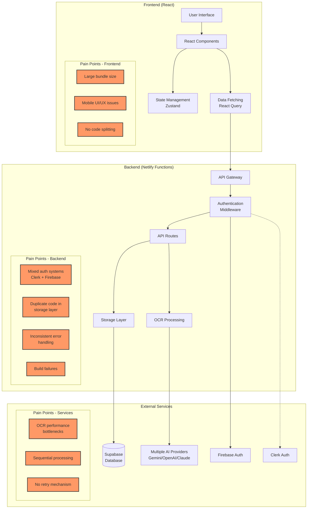
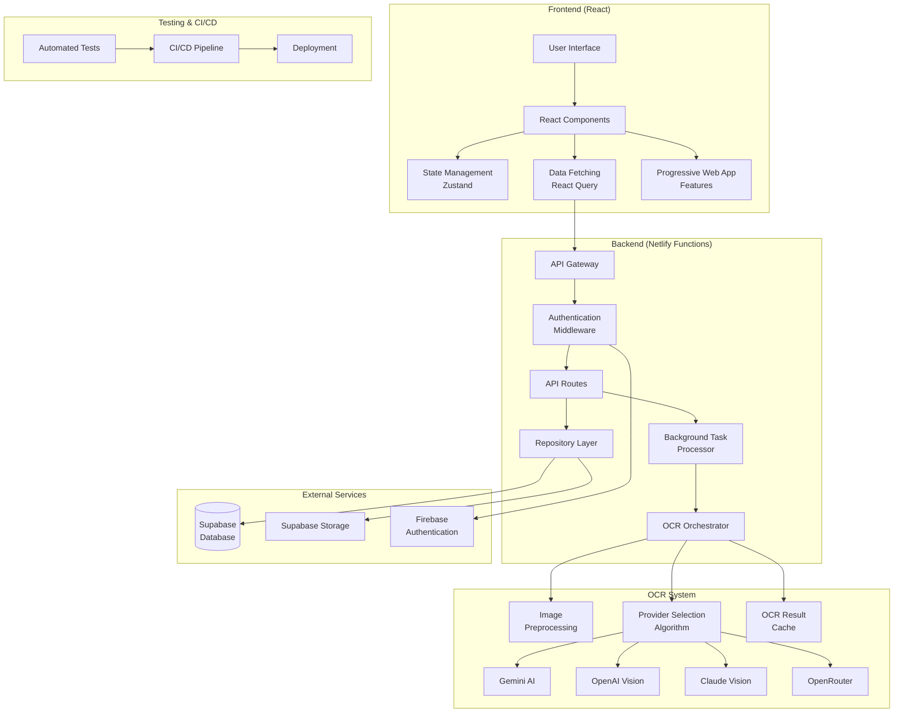
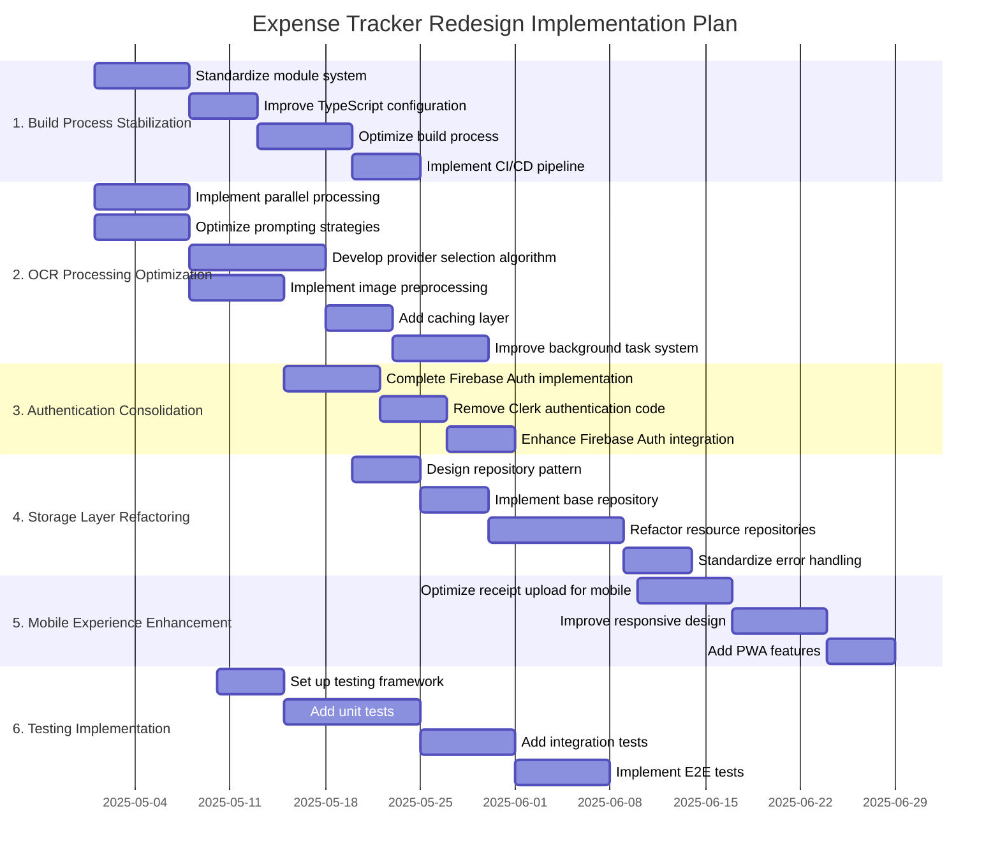

# Expense Tracker Redesign Recommendations

## 1. Current Architecture with Pain Points

## 2. Prioritized Issues and Solutions

### 2.1. Build Process Stability

**Current Issues:**
- Builds on Netlify serverless environments failing frequently
- Workarounds implemented in netlify-build.fix.js
- TypeScript compilation issues during build
- Mixed module systems (CommonJS and ES Modules)

**Recommended Solutions:**

1. **Standardize Module System**
   - Convert all files to ES Modules format
   - Update import/export statements to use consistent syntax
   - Remove CommonJS-specific code (require, module.exports)

2. **Improve TypeScript Configuration**
   - Update tsconfig.json with stricter settings
   - Add separate configurations for client and server
   - Implement path aliases for cleaner imports

3. **Optimize Build Process**
   - Replace custom build script with standard Netlify build plugins
   - Implement proper build steps for client and server
   - Add pre-build validation to catch issues early

4. **Implement CI/CD Pipeline**
   - Add GitHub Actions workflow for continuous integration
   - Implement automated testing before deployment
   - Create separate environments for development, staging, and production

### 2.2. OCR Processing Performance

**Current Issues:**
- OCR processing can take up to 30 seconds
- Sequential processing without parallelization
- Synchronous file handling
- Multiple external API calls to AI providers
- No provider selection strategy

**Recommended Solutions:**

1. **Implement Parallel Processing**
   - Process multiple receipts simultaneously using Promise.all
   - Implement a queue system for batch processing
   - Add concurrency limits to prevent rate limiting
   - Use worker threads for CPU-intensive preprocessing

2. **Optimize Prompting Strategies**
   - Refine prompts for each AI provider to improve accuracy and speed
   - Create receipt-type-specific prompts (restaurant, travel, retail, etc.)
   - Implement prompt versioning to track performance improvements
   - Add examples to prompts for few-shot learning

3. **Develop Provider Selection Algorithm**
   - Collect performance metrics for each provider by receipt type
   - Implement an algorithm that selects the optimal provider based on:
     - Historical accuracy for similar receipt types
     - Current response times
     - Cost considerations
   - Add fallback mechanisms for provider failures

4. **Implement Image Preprocessing**
   - Add image optimization before sending to AI providers
   - Implement contrast enhancement and noise reduction
   - Add automatic cropping to focus on receipt content
   - Reduce image resolution while maintaining readability

5. **Add Caching Layer**
   - Cache OCR results to avoid reprocessing identical receipts
   - Implement fingerprinting for receipt images
   - Add cache invalidation strategies
   - Use Supabase for persistent cache storage

6. **Improve Background Task System**
   - Enhance task status tracking with more granular states
   - Implement retry mechanism with exponential backoff
   - Add progress reporting for long-running tasks
   - Implement task prioritization

### 2.3. Authentication System Consolidation

**Current Issues:**
- Mixed authentication systems (Clerk and Firebase)
- Incomplete migration from Clerk to Firebase
- Potential security issues during transition
- Clerk webhook handler still present

**Recommended Solutions:**

1. **Complete Firebase Authentication Implementation**
   - Finalize the migration from Clerk to Firebase Authentication
   - Ensure all authentication flows are properly implemented
   - Implement proper JWT validation and refresh logic
   - Add comprehensive error handling for authentication failures

2. **Remove Clerk Authentication Code**
   - Remove Clerk webhook handler
   - Clean up all Clerk-specific authentication code
   - Update all authentication references to use Firebase
   - Remove Clerk dependencies from the project

3. **Enhance Firebase Authentication Integration**
   - Implement proper session management
   - Add multi-device support
   - Implement secure token storage
   - Add refresh token rotation for enhanced security

### 2.4. Storage Layer Refactoring

**Current Issues:**
- Duplicate code in storage implementations
- Inconsistent method signatures
- Mixed usage of async/await and promises
- Type inconsistencies

**Recommended Solutions:**

1. **Implement Repository Pattern**
   - Create a base repository class with common functionality
   - Implement specific repositories for each resource type
   - Ensure consistent method signatures and return types

2. **Standardize Error Handling**
   - Implement consistent error handling across all repositories
   - Create custom error classes for different error types
   - Add proper logging for all errors

3. **Improve Type Safety**
   - Enhance TypeScript types for better type checking
   - Use generics for reusable repository methods
   - Ensure consistency between schema and implementation

### 2.5. Mobile Experience Enhancement

**Current Issues:**
- Limited optimization for mobile devices
- No direct camera access for receipt uploads
- Drag-and-drop less useful on mobile
- Limited feedback during upload process

**Recommended Solutions:**

1. **Optimize Receipt Upload for Mobile**
   - Add direct camera access for mobile devices
   - Implement mobile-specific UI for receipt uploads
   - Add real-time feedback during upload process

2. **Improve Responsive Design**
   - Enhance responsive layouts for all components
   - Implement mobile-first design principles
   - Add touch-friendly UI elements

3. **Add Progressive Web App Features**
   - Implement offline capabilities
   - Add installable PWA functionality
   - Optimize performance for mobile networks

### 2.6. Testing Implementation

**Current Issues:**
- No formal testing approach
- Absence of unit tests
- No integration tests
- Manual testing only

**Recommended Solutions:**

1. **Implement Testing Framework**
   - Set up Jest for unit testing
   - Add React Testing Library for component tests
   - Implement Cypress for end-to-end testing

2. **Add Unit Tests**
   - Write tests for business logic
   - Test utility functions
   - Implement test coverage reporting

3. **Add Integration Tests**
   - Test API endpoints
   - Test database interactions
   - Test authentication flows

4. **Implement CI/CD Testing**
   - Add automated testing to CI/CD pipeline
   - Implement pre-commit hooks for basic tests
   - Add regression testing

## 3. Proposed Improved Architecture

## 4. Implementation Plan with Phases and Dependencies

## 5. Detailed Recommendations by Phase

### Phase 1: Build Process Stabilization (2-3 weeks)

**Objective:** Resolve build failures and establish a stable deployment pipeline.

**Tasks:**
1. **Standardize Module System**
   - Audit all files to identify CommonJS vs ES Modules usage
   - Update package.json to specify "type": "module"
   - Convert require() to import statements
   - Update export syntax to use named exports

2. **Improve TypeScript Configuration**
   - Create separate tsconfig files for client and server
   - Add strict type checking
   - Configure path aliases for cleaner imports
   - Add type checking to build process

3. **Optimize Build Process**
   - Replace custom netlify-build.fix.js with standard Netlify build plugins
   - Implement proper build steps for client and server
   - Add pre-build validation to catch issues early
   - Optimize asset handling and bundling

4. **Implement CI/CD Pipeline**
   - Set up GitHub Actions workflow
   - Add automated testing before deployment
   - Create separate environments (dev, staging, prod)
   - Implement deployment approval process

**Deliverables:**
- Stable build process with consistent success rate
- Automated CI/CD pipeline with proper testing
- Standardized codebase with consistent module system
- Improved TypeScript configuration with better type safety

### Phase 2: OCR Processing Optimization (3-4 weeks)

**Objective:** Reduce OCR processing time from 30 seconds to under 10 seconds while maintaining or improving accuracy.

**Tasks:**
1. **Implement Parallel Processing**
   - Create a worker pool for processing multiple receipts simultaneously
   - Implement a queue system with priority for batch processing
   - Add concurrency limits to prevent rate limiting
   - Use worker threads for CPU-intensive preprocessing
   - Implement asynchronous file handling

2. **Optimize Prompting Strategies**
   - Analyze current prompts and identify improvement opportunities
   - Create receipt-type-specific prompts (restaurant, travel, retail, etc.)
   - Implement A/B testing framework for prompt optimization
   - Add examples to prompts for few-shot learning
   - Create a prompt management system for versioning and tracking

3. **Develop Provider Selection Algorithm**
   - Instrument code to collect performance metrics for each provider
   - Create a database schema for storing provider performance data
   - Implement an algorithm that selects the optimal provider based on:
     - Historical accuracy for similar receipt types
     - Current response times
     - Cost considerations
   - Add fallback mechanisms for provider failures
   - Implement automatic failover between providers

4. **Implement Image Preprocessing**
   - Add image optimization pipeline before sending to AI providers
   - Implement contrast enhancement and noise reduction
   - Add automatic cropping to focus on receipt content
   - Reduce image resolution while maintaining readability
   - Add receipt orientation detection and correction

5. **Add Caching Layer**
   - Implement image fingerprinting for receipt deduplication
   - Create a cache schema in Supabase
   - Add cache lookup before processing
   - Implement cache invalidation strategies
   - Add cache warming for common receipt types

6. **Improve Background Task System**
   - Enhance task status tracking with more granular states
   - Implement retry mechanism with exponential backoff
   - Add progress reporting for long-running tasks
   - Implement task prioritization
   - Add task cancellation capability

**Deliverables:**
- OCR processing time reduced to under 10 seconds
- Improved accuracy of extracted data
- Better user feedback during processing
- Robust background task system with retry capabilities
- Provider selection algorithm that optimizes for speed and accuracy
- Comprehensive performance metrics for ongoing optimization

### Phase 3: Authentication Consolidation (2 weeks)

**Objective:** Complete the migration to Firebase Authentication and remove Clerk authentication code.

**Tasks:**
1. **Complete Firebase Authentication Implementation**
   - Ensure all authentication flows are properly implemented
   - Implement proper JWT validation and refresh logic
   - Add comprehensive error handling for authentication failures
   - Implement secure token storage

2. **Remove Clerk Authentication Code**
   - Remove Clerk webhook handler
   - Clean up all Clerk-specific authentication code
   - Update all authentication references to use Firebase
   - Remove Clerk dependencies from the project

3. **Enhance Firebase Authentication Integration**
   - Implement proper session management
   - Add multi-device support
   - Implement refresh token rotation
   - Add security enhancements like IP validation

**Deliverables:**
- Single, consistent authentication system using Firebase Authentication
- Improved security with proper JWT handling
- Cleaner codebase without Clerk authentication code
- Comprehensive authentication flows with proper error handling

### Phase 4: Storage Layer Refactoring (2-3 weeks)

**Objective:** Eliminate duplicate code and standardize storage implementations.

**Tasks:**
1. **Design Repository Pattern**
   - Create interface definitions for repositories
   - Define common methods and signatures
   - Design error handling strategy
   - Create type definitions for all entities

2. **Implement Base Repository**
   - Create abstract base repository class
   - Implement common CRUD operations
   - Add transaction support
   - Implement consistent error handling

3. **Refactor Resource Repositories**
   - Create specific repositories for each resource type
   - Implement specialized methods
   - Ensure consistent return types
   - Add proper documentation

4. **Standardize Error Handling**
   - Create custom error classes
   - Implement consistent error handling across all repositories
   - Add proper logging for all errors
   - Implement error recovery strategies

**Deliverables:**
- Clean, DRY storage layer with consistent interfaces
- Improved type safety and error handling
- Better maintainability and extensibility
- Consistent method signatures and return types

### Phase 5: Mobile Experience Enhancement (2 weeks)

**Objective:** Improve the mobile user experience, especially for receipt uploads.

**Tasks:**
1. **Optimize Receipt Upload for Mobile**
   - Add direct camera access for mobile devices
   - Implement mobile-specific UI for receipt uploads
   - Add real-time feedback during upload process
   - Implement image preview and editing

2. **Improve Responsive Design**
   - Audit and enhance responsive layouts
   - Implement mobile-first design principles
   - Add touch-friendly UI elements
   - Optimize for different screen sizes

3. **Add Progressive Web App Features**
   - Implement service workers for offline capabilities
   - Add installable PWA functionality
   - Implement push notifications
   - Optimize performance for mobile networks

**Deliverables:**
- Improved mobile user experience
- Direct camera access for receipt uploads
- Responsive design across all components
- Progressive Web App capabilities

### Phase 6: Testing Implementation (Ongoing)

**Objective:** Establish a comprehensive testing strategy and implement automated tests.

**Tasks:**
1. **Set Up Testing Framework**
   - Configure Jest for unit testing
   - Set up React Testing Library for component tests
   - Implement Cypress for end-to-end testing
   - Add test coverage reporting

2. **Add Unit Tests**
   - Write tests for business logic
   - Test utility functions
   - Implement test coverage reporting
   - Add tests for critical paths

3. **Add Integration Tests**
   - Test API endpoints
   - Test database interactions
   - Test authentication flows
   - Test error handling

4. **Implement E2E Tests**
   - Create end-to-end test scenarios
   - Test critical user flows
   - Implement visual regression testing
   - Add performance testing

**Deliverables:**
- Comprehensive test suite with good coverage
- Automated testing in CI/CD pipeline
- Improved code quality and reliability
- Regression testing for critical functionality

## 6. Trade-offs and Considerations

### OCR Provider Strategy

**Options:**
1. **Multi-provider Strategy with Selection Algorithm (Recommended)**
   - Pros: Leverages strengths of each provider, fault tolerance, optimizes for speed/accuracy
   - Cons: More complex implementation, requires performance tracking

2. **Single Provider Strategy**
   - Pros: Simpler implementation, consistent behavior
   - Cons: Single point of failure, may not be optimal for all receipt types

**Recommendation:** The multi-provider strategy with a selection algorithm provides the best balance of performance, accuracy, and reliability. By tracking performance metrics and selecting the optimal provider for each receipt type, we can achieve the target processing time while maintaining high accuracy.

### Authentication System

**Options:**
1. **Firebase Authentication (Recommended)**
   - Pros: Already partially implemented, robust features, good scalability, generous free tier
   - Cons: Separate service from database, more complex integration with Supabase

2. **Supabase Auth**
   - Pros: Integrated with database, Row Level Security, simpler architecture
   - Cons: Free plan limited to one session per user, paid plans required for scalability

**Recommendation:** Completing the migration to Firebase Authentication is the most practical approach given the current state of the application. It offers good scalability, a generous free tier, and robust features. The effort to complete the migration will be less than switching to a new authentication provider.

### Storage Layer Architecture

**Options:**
1. **Repository Pattern**
   - Pros: Clean separation of concerns, consistent interfaces, better testability
   - Cons: More boilerplate code, learning curve

2. **Direct Database Access (Current approach)**
   - Pros: Simpler, less code
   - Cons: Inconsistent implementations, duplicate code, harder to test

**Recommendation:** The repository pattern will provide better maintainability and testability, justifying the additional boilerplate code. It will also make it easier to implement consistent error handling and type safety.

## 7. Success Criteria

1. **Build Process Stability**
   - 95%+ success rate for builds and deployments
   - Automated CI/CD pipeline with proper testing
   - Consistent module system and TypeScript configuration

2. **OCR Processing Performance**
   - OCR processing time reduced from 30 seconds to under 10 seconds
   - Provider selection algorithm that achieves optimal accuracy/speed balance
   - Comprehensive performance metrics for ongoing optimization
   - Better user feedback during processing

3. **Authentication System**
   - Single, consistent authentication system using Firebase Authentication
   - No legacy Clerk authentication code
   - Comprehensive authentication flows with proper error handling

4. **Storage Layer**
   - Clean, DRY storage layer with consistent interfaces
   - Improved type safety and error handling
   - Consistent method signatures and return types

5. **Mobile Experience**
   - Direct camera access for receipt uploads
   - Responsive design across all components
   - Progressive Web App capabilities

6. **Testing**
   - Comprehensive test suite with good coverage
   - Automated testing in CI/CD pipeline
   - Regression testing for critical functionality