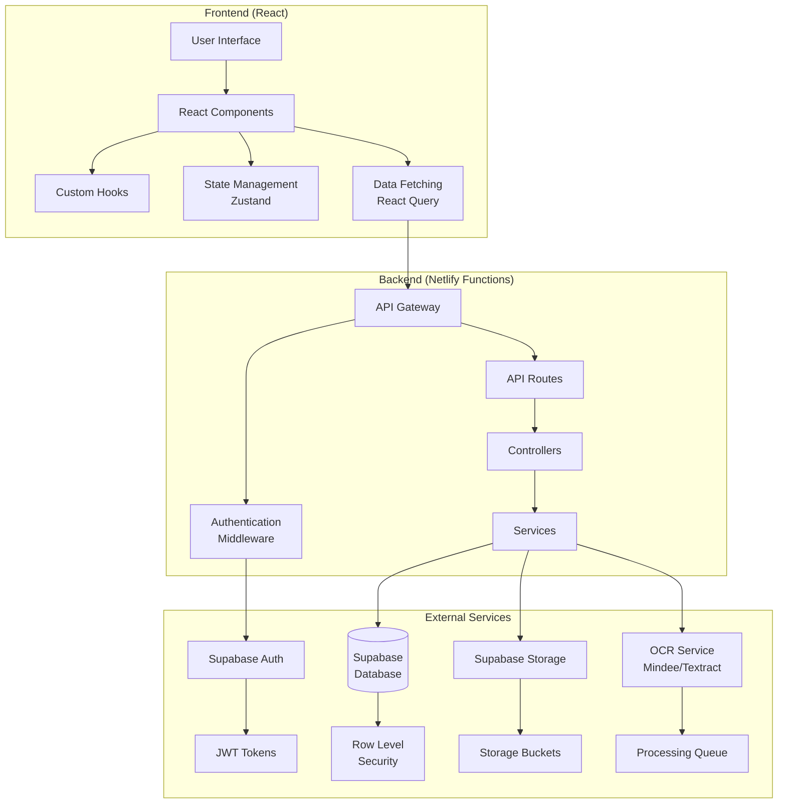
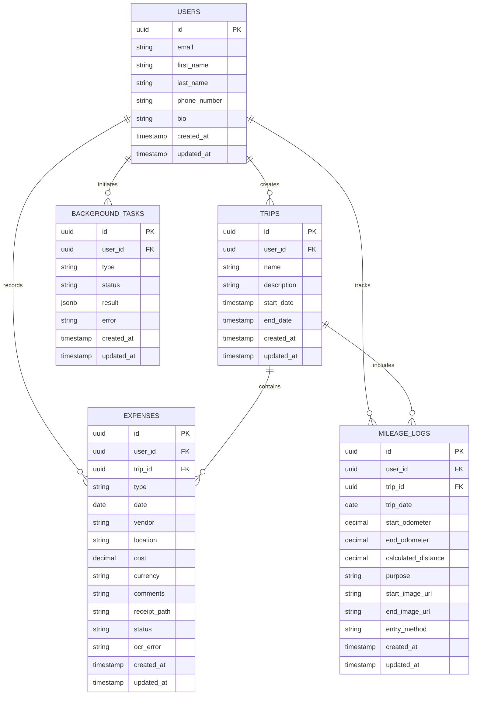

# Product Requirements Document (PRD) and Technical Plan for Expense Tracker Redesign

## 1. Executive Summary

The expense tracker application redesign aims to maintain the current functionality and frontend design while modernizing the tech stack and addressing key pain points, particularly the OCR processing for receipts. The redesign will leverage Supabase as the primary database and authentication provider, with a serverless architecture deployed on Netlify. The application will continue to provide comprehensive expense tracking, trip management, mileage logging, and data visualization capabilities, but with improved performance, reliability, and user experience.

## 2. Current Application Analysis

### Current Tech Stack
- **Frontend**: React with TypeScript, Vite, Shadcn UI, Tailwind CSS
- **State Management**: Zustand, React Query
- **Backend**: Node.js with Express
- **Database**: PostgreSQL with Drizzle ORM
- **Authentication**: Clerk
- **File Storage**: Supabase Storage
- **Deployment**: Netlify with serverless functions

### Main Features
- User authentication and profile management
- Trip management
- Expense tracking with receipt uploads
- OCR processing for receipts (identified as a pain point)
- Mileage logging
- Data visualization with charts
- Data export functionality
- Background task processing

### Pain Points
- OCR processing for receipts is slow and sometimes unreliable

## 3. Proposed Tech Stack with Justification

### Frontend
- **Framework**: React with TypeScript (maintain current)
- **Build Tool**: Vite (maintain current)
- **UI Components**: Shadcn UI with Tailwind CSS (maintain current)
- **State Management**: Zustand for global state (maintain current)
- **Data Fetching**: React Query (maintain current)
- **Routing**: Wouter (maintain current)

### Backend
- **Architecture**: Serverless with Netlify Functions
- **Database**: Supabase PostgreSQL (with Row Level Security)
- **Authentication**: Supabase Auth (replacing Clerk)
- **File Storage**: Supabase Storage (maintain current)
- **OCR Processing**: Specialized OCR service (Mindee, Document AI, or Amazon Textract)

### Justification
1. **Maintaining Frontend**: The current frontend design and functionality work well, so we'll maintain it to minimize disruption.
2. **Serverless Architecture**: Reduces operational complexity and improves scalability.
3. **Supabase Integration**: Provides a unified solution for database, authentication, and storage, simplifying the architecture.
4. **Specialized OCR Service**: Addresses the main pain point by providing more accurate and reliable OCR processing.
5. **Netlify Deployment**: Maintains the current deployment platform while leveraging its serverless capabilities.

## 4. Functional Requirements

1. **User Management**
   - User registration and authentication via Supabase Auth
   - User profile management (view and edit profile information)
   - Role-based access control (admin, regular user)
   - Email verification and password reset

2. **Trip Management**
   - Create, read, update, delete (CRUD) operations for trips
   - Associate expenses with trips
   - View trip summaries and statistics
   - Filter and search trips by date, name, etc.

3. **Expense Tracking**
   - CRUD operations for expenses
   - Categorize expenses by type
   - Associate expenses with trips
   - Upload and store receipts
   - Enhanced OCR processing for receipts with improved accuracy and reliability
   - Manual entry option as fallback
   - Batch upload and processing of receipts

4. **Mileage Logging**
   - CRUD operations for mileage logs
   - Calculate distance and estimated costs
   - Associate mileage logs with trips
   - OCR processing for odometer readings

5. **Data Visualization**
   - Dashboard with summary statistics
   - Expense breakdown by category
   - Expense trends over time
   - Trip-specific visualizations

6. **Data Export**
   - Export expenses and trips to various formats (CSV, Excel, PDF)
   - Customizable export options (date range, categories, etc.)
   - Scheduled exports (optional)

7. **Notifications**
   - Email notifications for important events
   - In-app notifications for background task completion

8. **Background Processing**
   - Asynchronous processing of OCR tasks
   - Batch operations for imports/exports
   - Queue management for long-running tasks

## 5. Non-Functional Requirements

1. **Performance**
   - Page load time under 2 seconds
   - API response time under 500ms for standard operations
   - Support for at least 100 concurrent users
   - Efficient handling of large datasets (1000+ expenses)
   - Optimized image processing for receipts

2. **Reliability**
   - 99.9% uptime for the application
   - Proper error handling and recovery mechanisms
   - Graceful degradation when services are unavailable
   - Data backup and recovery procedures

3. **Security**
   - Secure authentication and authorization
   - Data encryption in transit and at rest
   - Protection against common web vulnerabilities (OWASP Top 10)
   - Regular security audits and updates
   - Proper handling of sensitive information

4. **Scalability**
   - Horizontal scaling for increased load
   - Efficient database queries and indexing
   - Caching strategies for frequently accessed data
   - Optimized storage for receipts and other files

5. **Maintainability**
   - Clean, modular code architecture
   - Comprehensive documentation
   - Automated testing (unit, integration, end-to-end)
   - Consistent coding standards and practices
   - Version control and CI/CD pipelines

6. **Usability**
   - Intuitive and responsive user interface
   - Consistent design language
   - Accessibility compliance (WCAG 2.1 AA)
   - Mobile-friendly design
   - Helpful error messages and guidance

7. **Compatibility**
   - Support for modern browsers (Chrome, Firefox, Safari, Edge)
   - Responsive design for various screen sizes
   - Progressive Web App (PWA) capabilities for offline access

8. **Compliance**
   - GDPR compliance for user data
   - Secure handling of financial information
   - Audit trails for sensitive operations

## 6. User Stories

1. **Authentication and Profile Management**
   - As a user, I want to register for an account so that I can use the application
   - As a user, I want to log in to my account so that I can access my data
   - As a user, I want to reset my password if I forget it
   - As a user, I want to view and edit my profile information
   - As a user, I want to delete my account and all associated data

2. **Trip Management**
   - As a user, I want to create a new trip with details like name, description, and dates
   - As a user, I want to view all my trips in a list or calendar view
   - As a user, I want to edit trip details if plans change
   - As a user, I want to delete trips I no longer need
   - As a user, I want to see a summary of expenses for each trip

3. **Expense Tracking**
   - As a user, I want to add expenses manually with details like date, amount, category, and vendor
   - As a user, I want to upload receipts and have them automatically processed
   - As a user, I want to edit expense details if needed
   - As a user, I want to delete expenses I no longer need
   - As a user, I want to categorize expenses for better organization
   - As a user, I want to associate expenses with specific trips
   - As a user, I want to batch upload multiple receipts at once

4. **Mileage Logging**
   - As a user, I want to log mileage for business trips
   - As a user, I want to upload odometer images for verification
   - As a user, I want to calculate distance and estimated costs automatically
   - As a user, I want to associate mileage logs with specific trips

5. **Data Visualization and Reporting**
   - As a user, I want to see a dashboard with summary statistics
   - As a user, I want to view expense breakdowns by category
   - As a user, I want to see expense trends over time
   - As a user, I want to generate reports for specific date ranges
   - As a user, I want to export data for tax or reimbursement purposes

## 7. Technical Architecture

This architecture follows a modern approach with a clear separation of concerns:

1. **Frontend Layer**:
   - React components for UI rendering
   - Custom hooks for reusable logic
   - Zustand for global state management
   - React Query for data fetching, caching, and synchronization

2. **Backend Layer (Serverless)**:
   - Netlify Functions as the API gateway
   - Authentication middleware for security
   - API routes for different resources
   - Controllers for handling requests
   - Services for business logic

3. **External Services**:
   - Supabase for database with Row Level Security
   - Supabase Auth for authentication and authorization
   - Supabase Storage for file storage
   - Specialized OCR service for receipt processing

## 8. Data Model

Key changes from the current data model:

1. Using UUID as primary keys instead of serial integers for better security and distribution
2. Adding proper timestamps for start_date and end_date in the TRIPS table
3. Adding currency field to EXPENSES for international support
4. Using proper PostgreSQL data types (uuid, jsonb, etc.)
5. Maintaining all existing relationships
6. Ensuring proper foreign key constraints

## 9. API Specifications

1. **Authentication API**:
   - POST /auth/register - Register a new user
   - POST /auth/login - Log in a user
   - POST /auth/logout - Log out a user
   - POST /auth/reset-password - Request password reset
   - GET /auth/user - Get current user information

2. **User API**:
   - GET /api/users/profile - Get user profile
   - PUT /api/users/profile - Update user profile
   - GET /api/users/settings - Get user settings
   - PUT /api/users/settings - Update user settings

3. **Trip API**:
   - GET /api/trips - Get all trips for the current user
   - GET /api/trips/:id - Get a specific trip
   - POST /api/trips - Create a new trip
   - PUT /api/trips/:id - Update a trip
   - DELETE /api/trips/:id - Delete a trip
   - GET /api/trips/:id/expenses - Get expenses for a trip
   - GET /api/trips/:id/mileage - Get mileage logs for a trip

4. **Expense API**:
   - GET /api/expenses - Get all expenses for the current user
   - GET /api/expenses/:id - Get a specific expense
   - POST /api/expenses - Create a new expense
   - PUT /api/expenses/:id - Update an expense
   - DELETE /api/expenses/:id - Delete an expense
   - POST /api/expenses/batch - Batch upload expenses

5. **Receipt API**:
   - POST /api/receipts/upload - Upload a receipt
   - GET /api/receipts/:id - Get a receipt
   - POST /api/receipts/:id/ocr - Process a receipt with OCR
   - GET /api/receipts/:id/ocr-result - Get OCR results for a receipt

6. **Mileage API**:
   - GET /api/mileage - Get all mileage logs for the current user
   - GET /api/mileage/:id - Get a specific mileage log
   - POST /api/mileage - Create a new mileage log
   - PUT /api/mileage/:id - Update a mileage log
   - DELETE /api/mileage/:id - Delete a mileage log
   - POST /api/mileage/odometer-image - Process an odometer image

7. **Export API**:
   - POST /api/export/expenses - Export expenses to various formats
   - POST /api/export/trips - Export trips to various formats
   - POST /api/export/mileage - Export mileage logs to various formats
   - GET /api/export/:id - Get the status of an export job
   - GET /api/export/:id/download - Download an exported file

8. **Task API**:
   - GET /api/tasks - Get all background tasks for the current user
   - GET /api/tasks/:id - Get a specific background task
   - DELETE /api/tasks/:id - Delete a background task

## 10. Deployment Strategy

1. **Development Environment**:
   - Local development setup with Supabase local development
   - Environment variables for configuration
   - Hot reloading for rapid development

2. **Staging Environment**:
   - Netlify preview deployments for frontend
   - Separate Supabase project for staging
   - Automated deployments from staging branch
   - End-to-end testing in staging environment

3. **Production Environment**:
   - Netlify production deployment
   - Production Supabase project
   - Automated deployments from main branch
   - Monitoring and alerting setup

4. **CI/CD Pipeline**:
   - GitHub Actions for CI/CD
   - Automated testing before deployment
   - Build and deployment automation
   - Environment-specific configuration

5. **Monitoring and Logging**:
   - Application monitoring with Netlify Analytics
   - Error tracking with Sentry
   - Supabase monitoring for database performance
   - Centralized logging solution

## 11. Implementation Plan with Detailed Task Breakdown

### Phase 1: Project Setup and Infrastructure (2 weeks)
- Set up GitHub repository
- Initialize React project with Vite
- Configure Tailwind CSS and Shadcn UI
- Set up Supabase project and database
- Configure Netlify deployment
- Set up CI/CD pipeline

### Phase 2: Core Functionality (3 weeks)
- Implement authentication with Supabase Auth
- Develop user profile management
- Create trip management functionality
- Implement basic expense tracking
- Set up file storage for receipts

### Phase 3: Advanced Features (3 weeks)
- Implement enhanced OCR processing
- Develop mileage logging functionality
- Create data visualization components
- Implement export functionality
- Develop background task processing

### Phase 4: Testing and Optimization (2 weeks)
- Write unit and integration tests
- Perform end-to-end testing
- Optimize performance
- Conduct security audit
- Fix bugs and issues

### Phase 5: Deployment and Documentation (1 week)
- Deploy to production
- Create user documentation
- Write technical documentation
- Conduct user acceptance testing
- Finalize project handover

**Total estimated timeline: 11 weeks**

## Key Benefits of the Redesign

1. Improved OCR processing for receipts with higher accuracy and reliability
2. Serverless architecture for better scalability and reduced operational complexity
3. Integrated authentication and database solution with Supabase
4. Enhanced security with Row Level Security and proper authentication
5. Better performance and user experience
6. Simplified deployment and maintenance

## Risks and Mitigation

1. Data migration risks - Mitigated with proper testing and validation
2. Learning curve for new technologies - Mitigated with documentation and training
3. Integration challenges - Mitigated with proper planning and testing
4. Performance concerns - Mitigated with optimization and monitoring

## Success Criteria

1. All current functionality is maintained or improved
2. OCR processing is more accurate and reliable
3. Application performance meets or exceeds non-functional requirements
4. User experience is maintained or improved
5. Deployment and maintenance processes are simplified